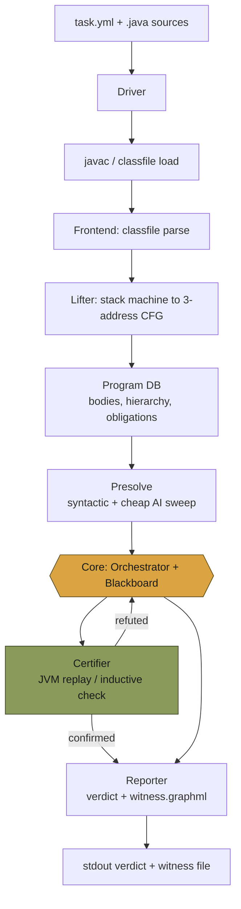
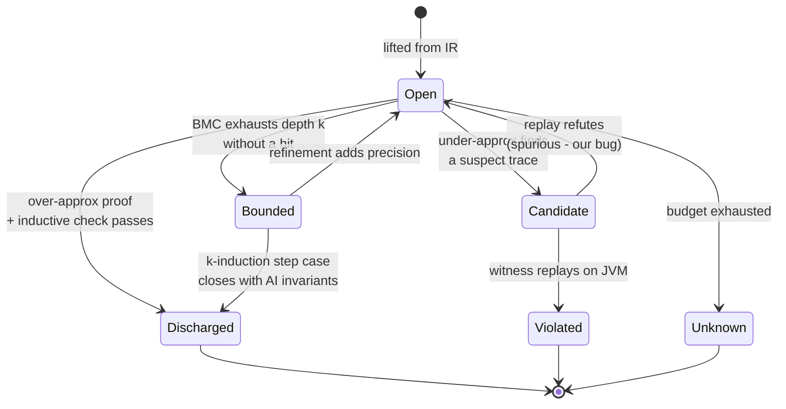
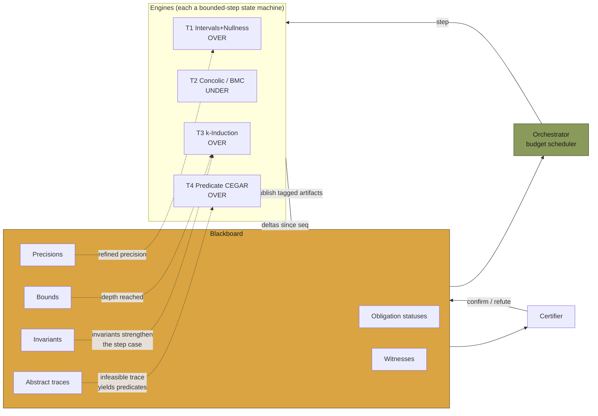
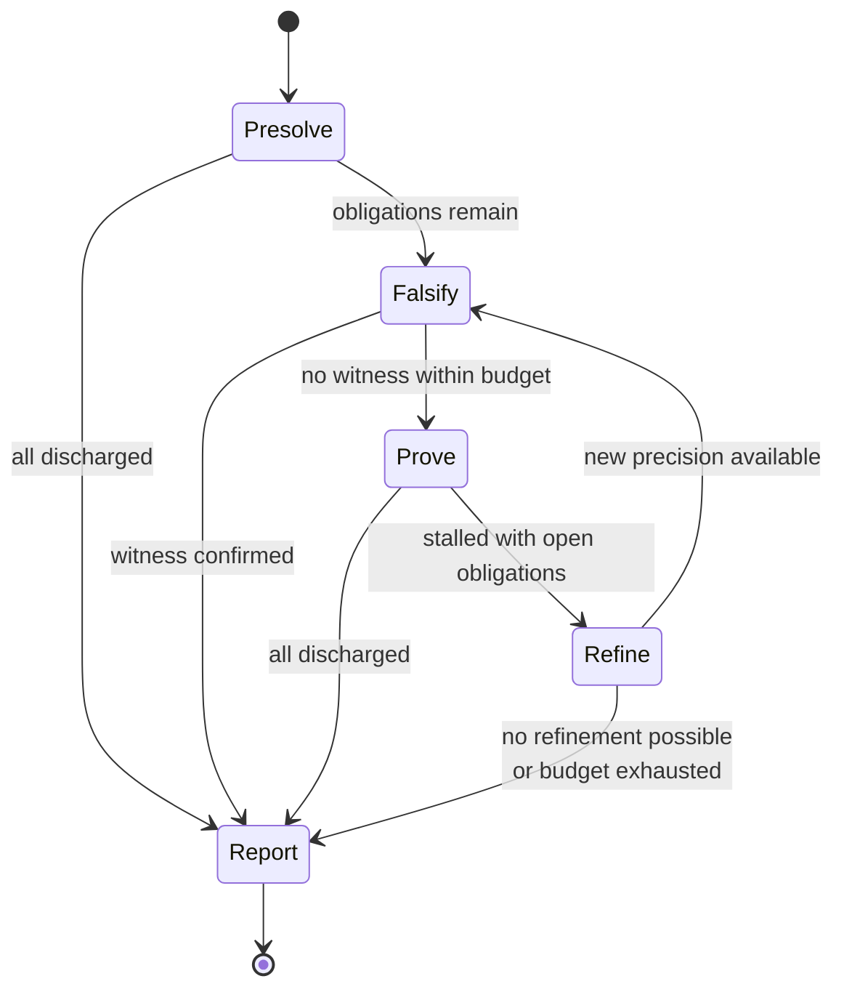
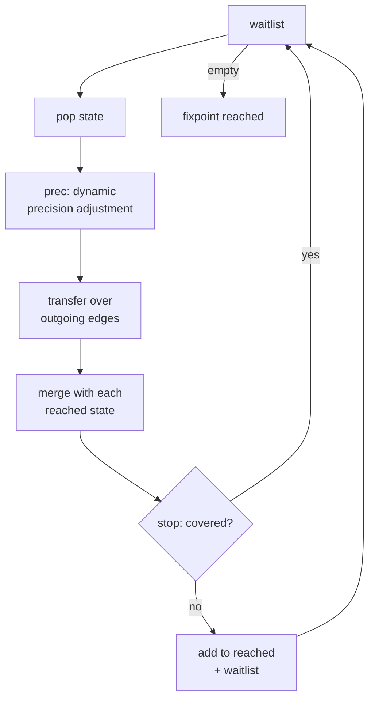

# roast — architecture

## 0. The thesis

The SV-COMP Java field is falsification-shaped. JBMC is bounded model checking,
GDart is concolic; neither can prove unbounded safety, and the winner captures
only ~55% of available score (1561 / 2821 in 2026). The gap is in `TRUE`, which
is worth double, and it widened when the runtime-exception property tripled the
task count.

roast is built around three commitments that follow from that:

1. **Obligations, not programs.** The unit of work is a single proof obligation
   (one implicit or explicit check), not a whole-program verdict. Partial
   progress then composes, and both SV-COMP Java specifications collapse into
   one question: *is this check reachable?*
2. **Artifacts, not verdicts.** Engines exchange invariants, precisions, traces
   and bounds through a shared blackboard. A portfolio that only exchanges
   verdicts throws away almost everything each engine learned.
3. **Nothing is trusted.** Every `FALSE` is a witness replayed on a real JVM;
   every `TRUE` is an invariant checked inductively by a separate small checker.

## 1. Tool pipeline

The lifter is where the person-months go, not the solver. Everything right of
`Program DB` is language-agnostic and could be pointed at another frontend.

## 2. Obligation lifecycle (state machine)

Every check in the IR is an obligation moving through this machine. The whole
task is `TRUE` when all obligations reach `Discharged`, `FALSE` the moment one
reaches `Violated`.

`Candidate --> Open` is the important edge. A suspect trace whose witness fails
to replay is *our* bug, not a verdict, and it must never leak out as `FALSE`.
That edge is why we score zero instead of −16.

## 3. Core: blackboard + orchestrator

Every artifact carries a `Direction` tag — `Over`, `Under`, or `Exact`. The
blackboard refuses, at runtime, to accept a `Discharged` status from an
under-approximating producer or a `Violated` from an over-approximating one.
That is the same rule `verdict.rs` enforces in the type system; belt and braces,
because this is the single place a soundness bug turns into a −32.

The direction it checks is the one each engine *declared* via
`Engine::direction`, registered with the blackboard by the orchestrator before
scheduling begins. That registration exists because the gate used to read only
the direction handed to `publish`, and an engine is free to pass a different
one per call — `NraEngine` declared `Over` while publishing as `Under`, and
nothing could see the disagreement.

> **What is implemented, as of this writing.** The diagram above is the design.
> The parts that exist are the blackboard itself, `Status` artifacts, the
> direction discipline, and `JvmReplay` as the `Certifier` for violations.
> The parts that do not: no engine publishes an invariant, trace, precision or
> residual, so the dotted cross-engine arrows carry nothing today, and the
> `deltas since seq` cursor API has no callers — engines poll
> `Blackboard::open` instead. There is no certifier for a `Discharged` status,
> so a TRUE rests on the discharging engine plus the direction rule rather than
> on an independently re-checked certificate. `roast-core::artifact` and
> `roast-core::certify` say the same in their module docs, and
> `docs/strategies/README.md` says it per engine.

## 4. Orchestrator schedule (state machine)

Falsify-before-prove is deliberate. Bugs are cheap to find and cheap to
certify, and finding one ends the task immediately; proofs are expensive and
only worth starting once the easy exit is closed off.

## 5. The CPA substrate

Underneath the engines sits one reachability algorithm parameterised by a
Configurable Program Analysis — `(initial, transfer, merge, stop, prec)` after
Beyer/Henzinger/Théoduloz. New abstract domains plug in without touching the
fixpoint loop, and `Product<A, B>` composes two CPAs into one.

Choosing `merge_sep` + `stop_sep` gives you explicit-state model checking;
`merge_join` + `stop_join` gives you abstract interpretation; a predicate domain
with `prec` doing refinement gives you lazy abstraction. Same loop, three
techniques. That is the extensibility story.

## 6. Methods in the core, and how they combine

| Tier | Method | Direction | Consumes | Publishes |
|---|---|---|---|---|
| 0 | Lifting + obligation generation | Exact | classfiles | obligations |
| 1 | Interval / nullness / array-length AI | Over | precisions | invariants, discharges |
| 2 | Concolic + bounded symbolic execution | Under | precisions | witnesses, traces |
| 3 | BMC + k-induction | Over | **invariants (T1)**, bounds | discharges, bounds |
| 4 | Predicate abstraction, CEGAR | Over | **traces (T2)** | precisions, discharges |
| 5 | CHC encoding, external Horn solver | Over | IR | invariants |

The four combinations that matter, in rough order of payoff per unit of effort:

**A. Invariant injection (T1 → T3).** Most properties aren't *k*-inductive for
any usable *k*. Feeding interval invariants into the step case as auxiliary
assumptions is what makes k-induction actually close, and it is the single
highest-leverage pairing in the literature. No Java-track tool currently does it.

**B. CEGAR over infeasible traces (T2 → T4 → T1).** An abstract trace that BMC
proves infeasible yields interpolants; those become predicates; those become
precision for the next AI pass. The classic loop, but here it runs through the
blackboard rather than being hard-wired, so any producer of traces feeds it.

**C. Conditional model checking (any → any).** An engine that gives up publishes
a *condition* describing the state space it did cover, and the next engine
analyses only the residual. This is the least-exploited idea in the competition
and the most natural fit for a blackboard.

**D. CHC as an escape hatch (T5).** Encode the whole obligation to Horn clauses
and let Golem or Eldarica find the invariant. Cheap to build once the IR exists,
and it covers cases the hand-built domains miss.

## 7. Extension points

Adding a technique means implementing one of three traits, and nothing else in
the tree changes:

- `Cpa` (`roast-core::cpa`) — a new abstract domain riding the shared fixpoint loop, implemented in `roast-engines`.
- `Engine` (`roast-core::engine`) — a new strategy with its own control flow and step budget, implemented in `roast-engines` and registered in `roast-cli`.
- `Certifier` (`roast-core::certify`) — a new way of checking an artifact you don't trust.

See `docs/crates.md` for the dependency graph these boundaries are enforced
against, and `docs/strategies/` for the write-up each concrete `Engine`/`Cpa`
implementation is required to have before it's registered.
